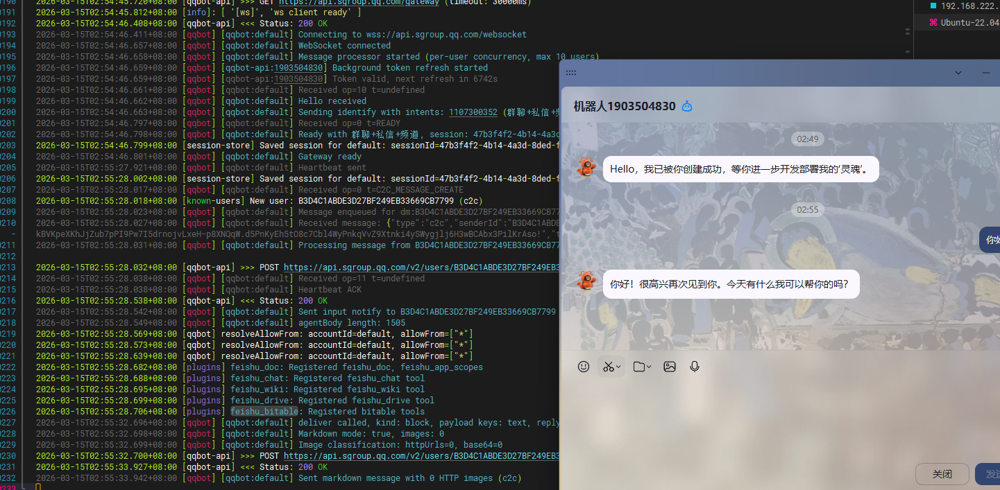
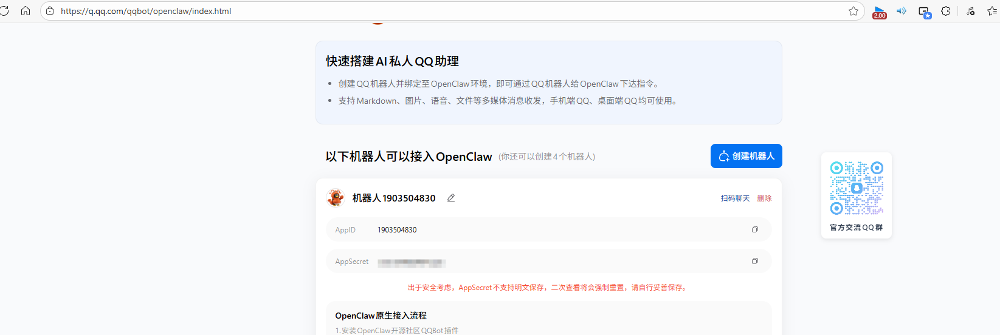
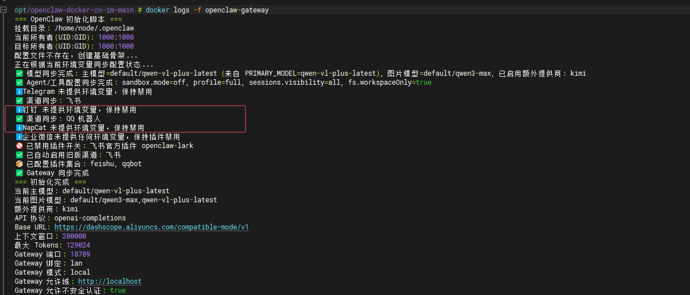

# 项目文件说明


- [`Dockerfile`](Dockerfile) - Docker 镜像构建文件
- [`init.sh`](init.sh) - 容器初始化脚本（作为主程序运行）
- [`docker-compose.yml`](docker-compose.yml) - Docker Compose 配置文件
- [`.env.example`](.env.example) - 环境变量配置模板
- [`.dockerignore`](.dockerignore) - Docker 构建忽略文件
- [`openclaw.json.example`](openclaw.json.example) - OpenClaw 默认配置文件示例

# 参考项目

 https://github.com/justlovemaki/OpenClaw-Docker-CN-IM

# 部署

## 镜像源配置

**docker镜像源**

```bash
mkdir -p /etc/docker

cat > /etc/docker/daemon.json << 'EOF'
{
  "registry-mirrors": [
    "https://docker.m.daocloud.io",
    "https://docker.1panel.live",
    "https://hub.rat.dev",
    "https://docker.mirrors.ustc.edu.cn"
  ]
}
EOF

systemctl restart docker
```

**apt镜像源**

```bash
sudo vim /etc/apt/sources.list

deb https://mirrors.aliyun.com/ubuntu/ jammy main restricted universe multiverse
deb https://mirrors.aliyun.com/ubuntu/ jammy-updates main restricted universe multiverse
deb https://mirrors.aliyun.com/ubuntu/ jammy-backports main restricted universe multiverse
deb https://mirrors.aliyun.com/ubuntu/ jammy-security main restricted universe multiverse

sudo apt update
```

## 方式一：使用预构建镜像

### 1. 下载配置文件

```bash
wget https://raw.githubusercontent.com/justlovemaki/OpenClaw-Docker-CN-IM/main/docker-compose.yml
wget https://raw.githubusercontent.com/justlovemaki/OpenClaw-Docker-CN-IM/main/.env.example
```

### 2. 配置环境变量

```bash
# 复制环境变量模板
cp .env.example .env

# 编辑配置文件（至少配置 AI 模型相关参数）
nano .env
```

**最小配置示例**：

| 环境变量 | 说明 | 示例值 |
|---------|------|--------|
| `MODEL_ID` | AI 模型名称 | `gpt-4` |
| `BASE_URL` | AI 服务 API 地址 | `https://api.openai.com/v1` |
| `API_KEY` | AI 服务 API 密钥 | `sk-xxx...` |

> 💡 **提示**：IM 平台配置为可选项，可以先启动服务，后续再配置需要的平台。

### 3. 启动服务

```bash
docker-compose up -d
```

### 4. 查看日志

```bash
docker-compose logs -f
```

### 5. 更新 / 升级建议

推荐直接克隆项目进行维护，这样后续升级时可以先同步项目内的 [`README.md`](README.md)、[`docker-compose.yml`](docker-compose.yml) 和 [`.env.example`](.env.example) 等文件，再强制拉取最新镜像并重建启动，避免遗漏新的配置项或编排变更。

**推荐升级流程**：

```bash
# 首次使用（如果还没有克隆项目）
git clone https://github.com/justlovemaki/OpenClaw-Docker-CN-IM.git
cd OpenClaw-Docker-CN-IM

# 后续升级时，先更新项目文件
git pull

# 如有需要，对照最新 .env.example 补充或调整本地 .env 配置

# 强制拉取最新镜像并重建启动
docker compose pull
docker compose up -d --force-recreate
```

> 💡 **说明**：如果你是通过单独下载 [`docker-compose.yml`](docker-compose.yml) 和 [`.env.example`](.env.example) 的方式部署，升级时也建议优先同步这两个文件，再执行 [`docker compose pull`](README.md:117) 与 [`docker compose up -d --force-recreate`](README.md:118)。


###  6. 停止服务

```bash
docker-compose down
```

### 7. 进入容器

如需进入容器进行调试或执行命令：

```bash
#  docker 命令进入容器
docker exec -it openclaw-gateway /bin/bash
```

进入容器后，**请先执行 `su node` 切换到 node 用户**，然后再执行相关命令（否则可能会由于权限问题导致命令执行失败）：

```bash
# 切换到 node 用户（必需）
su node

# 查看 OpenClaw 版本
openclaw --version

# 查看配置文件
cat ~/.openclaw/openclaw.json

# 查看工作空间
ls -la ~/.openclaw/workspace

# 手动执行配对命令（如 Telegram）
openclaw pairing approve telegram {token}

# 手动安装官方飞书插件
npx -y @larksuite/openclaw-lark-tools install
```


## 方式二：自行构建镜像

### 1. 克隆项目

```bash
git clone git@github.com:Auroraol/openclaw-docker-cn.git
cd openclaw-docker-cn
```

### 2. 本地构建镜像

可以注释不需要的插件, 加速构建镜像

```bash
docker build -t openclaw:local .
docker build --network=host -t openclaw:local .


export DOCKER_BUILDKIT=1
docker build --progress=plain -t openclaw . 2>&1 | tee build.log

# 2. 如果某一步总是失败，单独调试该步骤
docker build --target=<step_name> .
```


### 3. 配置环境变量

```bash
# 复制环境变量模板
cp .env.example .env

# 编辑配置文件（至少配置LLM相关参数）
nano .env

#
# Docker 镜像配置                                                                
OPENCLAW_IMAGE=openclaw:local    
```

### 4. 启动服务

```bash
docker-compose up -d
docker compose up -d --force-recreate  只会强制重新创建容器，但不会重新构建镜像
```

# 使用效果

## 飞书机器人


## qq机器人



# 配置

配置文件:

```
cat ~/.openclaw/openclaw.json   # 所有配置持久化在此
```

## LLM 配置

支持 **OpenAI 协议**和 **Claude 协议**两种 API 格式。

**基础配置参数**

| 参数 | 说明 | 默认值 |
|------|------|--------|
| `MODEL_ID` | 模型名称 | `model id` |
| `PRIMARY_MODEL` | 显式指定 `agents.defaults.model.primary`，使用完整 `provider/model` 引用 | 留空 |
| `IMAGE_MODEL_ID` | 图片模型名称，可单独指定；支持直接填写完整 `provider/model` 引用 | 留空 |
| `BASE_URL` | Provider Base URL | `http://xxxxx/v1` |
| `API_KEY` | Provider API Key | `123456` |
| `API_PROTOCOL` | API 协议类型 | `openai-completions` |
| `CONTEXT_WINDOW` | 模型上下文窗口大小 | `200000` |
| `MAX_TOKENS` | 模型最大输出 tokens | `8192` |

**协议类型说明**

| 协议类型 | 适用模型 | Base URL 格式 | 特殊特性 |
|---------|---------|--------------|---------|
| `openai-completions` | OpenAI、Gemini 等 | 需要 `/v1` 后缀 | - |
| `anthropic-messages` | Claude | 不需要 `/v1` 后缀 | Prompt Caching、Extended Thinking |

### 配置示例

在 `.env` 文件中配置：

```bash
# 主模型 (留空时默认使用 MODEL_ID的第一个值)
# 可直接填写完整 provider/model，例如 aliyun/qwen-vl-max
PRIMARY_MODEL=qwen-vl-plus-latest
# 图片模型 (留空时默认使用MODEL_ID的第一个值)
IMAGE_MODEL_ID=

# LLM支持多个，用逗号隔开
MODEL_ID=qwen3-max,qwen-vl-plus-latest 
BASE_URL=https://dashscope.aliyuncs.com/compatible-mode/v1
API_KEY=your-api-key
# API 协议类型: openai-completions 或 anthropic-messages
API_PROTOCOL=openai-completions
# 模型上下文窗口大小
CONTEXT_WINDOW=200000
# 模型最大输出 tokens
MAX_TOKENS=129024

# # 提供商 2(kimi) (可选)
MODEL2_NAME=kimi
MODEL2_MODEL_ID=kimi-k2-turbo-preview
MODEL2_BASE_URL=https://api.moonshot.cn/v1
MODEL2_API_KEY=your-api-key
MODEL2_PROTOCOL=openai-completions
MODEL2_CONTEXT_WINDOW=200000
MODEL2_MAX_TOKENS=8192

# 提供商 3（DeepSeek）(可选)
# MODEL3_NAME=deepseek
#MODEL3_MODEL_ID=deepseek-chat
#MODEL3_BASE_URL=https://api.deepseek.com/v1
#MODEL3_API_KEY=sk-deepseek-789012
#MODEL3_PROTOCOL=openai-completions
#MODEL3_CONTEXT_WINDOW=128000
#MODEL3_MAX_TOKENS=8192
```

[模型大全功能规格与计费:](https://help.aliyun.com/zh/model-studio/models#03a05ab98953u)


注意：[`PRIMARY_MODEL`](.env.example) 和 [`IMAGE_MODEL_ID`](.env.example) 都可以填写完整引用，即 `provider/model` 格式，例如：

- `default/dashscope/qwen3.5-plus`
- `aliyun/qwen3.5-plus`
- `aliyun/qwen-vl-max`
- `model2/claude-sonnet-4-5`

## Gateway 配置

| 参数 | 说明 | 默认值 |
|------|------|--------|
| `OPENCLAW_GATEWAY_TOKEN` | Gateway 访问令牌 | `123456` |
| `OPENCLAW_GATEWAY_BIND` | 绑定地址 | `lan 只绑定到局域网地址` |
| `OPENCLAW_GATEWAY_PORT` | Gateway 端口 | `18789` |
| `OPENCLAW_BRIDGE_PORT` | Bridge 端口 | `18790` |

### 配置示例

在 `.env` 文件中配置：

```bash
# 网关 token，用于认证
OPENCLAW_GATEWAY_TOKEN=123456
OPENCLAW_GATEWAY_BIND=lan
OPENCLAW_GATEWAY_PORT=18789
OPENCLAW_BRIDGE_PORT=18790
OPENCLAW_GATEWAY_MODE=local
# 允许的 Origin 域，多个用逗号隔开
OPENCLAW_GATEWAY_ALLOWED_ORIGINS=http://localhost
# 是否使用HTTPS，可选 true/false
OPENCLAW_GATEWAY_ALLOW_INSECURE_AUTH=true
# 如果从公网访问，建议禁用设备认证
OPENCLAW_GATEWAY_DANGEROUSLY_DISABLE_DEVICE_AUTH=false
# 网关认证模式，可选 token
OPENCLAW_GATEWAY_AUTH_MODE=token
# 插件全局控制
OPENCLAW_PLUGINS_ENABLED=true
```

**可以直接访问localhost:18789**

### `origin not allowed`

获取Windows IP

```
opt/openclaw-main # WINDOWS_IP=$(ip route | grep default | awk '{print $3}')
echo "Windows IP: $WINDOWS_IP"
Windows IP: 172.18.240.1
```

在 `.env` 文件中配置Windows IP

```
OPENCLAW_GATEWAY_ALLOWED_ORIGINS=http://localhost,  http://localhost:18789,http://127.0.0.1:18789, http://172.18.240.1:18789,http://172.18.240.1,
```

### `pairing required`

```
# 进入容器
docker exec -it openclaw-gateway /bin/bash
# 切换到 node 用户（必需）
su node
# 查看请求设备授权
openclaw devices list
# 将requestid复制出来执行下面命令，然后执行完界面上刷新则成功了。
openclaw devices approve 这里填 request-id
```


效果


## 聊天策略

私聊策略 (`DM_POLICY`)

- `open` — 响应所有人
- `closed` — 不响应任何人
- `friend-only` — 仅好友/同事
- `allowlist` — 仅白名单用户（需配合 `ALLOW_FROM` 列表）

群组策略 (`GROUP_POLICY`)

- `open` — 响应所有群
- `closed` — 不响应任何群
- `allowlist` — 仅白名单群组（需配合 `GROUP_ALLOW_FROM` 列表）


## 工作空间配置

WORKSPACE 是 AI 机器人可以安全访问和修改文件的专用目录，类似于一个"沙箱环境"。

| 参数 | 说明 | 默认值 |
|------|------|--------|
| `WORKSPACE` | 工作空间目录 | `/home/node/.openclaw/workspace` |

---

#  skills使用

```bash
docker exec -it openclaw-gateway /bin/bash
查看已安装技能
openclaw skills list
```


## 安装技能

```bash
# 登录
npx clawhub login
# 搜索技能
npx clawhub search capability-evolver
# 直接安装
npx clawhub install capability-evolver
# 批量安装多个
npx clawhub install capability-evolver self-improving-agent tavily-search summarize github
```

## 示例

登录clawhub

```bash
node@e217d58ae6b0:~$ npx clawhub whoami
Error: Not logged in. Run: clawhub login
node@e217d58ae6b0:~$ npx clawhub login
Opening browser: https://clawhub.ai/cli/auth?redirect_uri=http%3A%2F%2F127.0.0.1%3A41313%2Fcallback&label_b64=Q0xJIHRva2Vu&state=41f9a3521677f583f6977baf6d83bca5
^C
node@e217d58ae6b0:~$ npx clawhub login --token clh_1mov9RWOiT5QyRrX4B0QkZ8tjILD5EforBAftWIiOJ0
✔ OK. Logged in as @Auroraol.
```


使用clawhub安装

```
node@e217d58ae6b0:~$ npx clawhub install agent-browser
```


web查看


# 常见问题

## 其他常见问题

[OpenClawChineseTranslation/docs/FAQ.md at main · 1186258278/OpenClawChineseTranslation](https://github.com/1186258278/OpenClawChineseTranslation/blob/main/docs/FAQ.md#missing-workspace-template-agentsmd)

## Q: 修改了环境变量但配置没有生效？

容器启动时只有在配置文件不存在时才会生成新配置。如需重新生成配置，请删除现有配置文件：

```bash
# 删除配置文件
rm ~/.openclaw/openclaw.json
# 重启容器
docker-compose restart
```

或者直接删除整个数据目录重新开始：

```bash
rm -rf ~/.openclaw
docker-compose up -d
```

## Q: 连接 AIClient-2-API 失败？

- 确认 AIClient-2-API 服务运行中
- 检查 Base URL 是否正确（OpenAI 协议需要 `/v1` 后缀）
- 尝试使用 `127.0.0.1` 替代 `localhost`

## Q: 401 错误？

- 检查 API Key 是否正确配置
- 确认环境变量 `API_KEY` 已设置

## Q: 模型不可用？

- 在 AIClient-2-API Web UI 确认已配置对应提供商
- 重启容器：`docker-compose restart`

## Q: 飞书机器人能发消息但收不到消息？

- 检查是否配置了事件订阅（最容易遗漏的配置）
- 确认事件配置方式选择了"使用长连接接收事件"
- 确认已添加 `im.message.receive_v1` 事件

## Q: Telegram 机器人如何配对？

如果需要启用 Telegram，必须提供有效的 `TELEGRAM_BOT_TOKEN`，启用后需要进入容器（参考“进入容器”章节）执行以下命令进行配对审批：

```bash
# 先切换到 node 用户
su node

# 执行配对审批
openclaw pairing approve telegram {token}
```

并且需要重启 Docker 服务使配置生效。

## Q: 同样的启动命令，为什么有人报错 `Permission denied`？

这通常不是命令本身不稳定，而是**运行上下文变化**导致：宿主机挂载目录所有者（UID/GID）与容器内进程用户不一致。

## 为什么会“偶发”

- 同样是 `docker compose up -d`，但目录来源不同：
  - 你手动创建目录：可能是当前用户（如 `1000:1000`）
  - Docker 自动创建或使用 sudo 创建：可能是 `root:root`（`0:0`）
- 本镜像最终以 `node` 用户运行网关；若挂载目录归属不匹配，就可能无法写入。

## 快速排查

```bash
# 1) 看宿主机目录归属（Linux）
ls -ln ~/.openclaw

# 2) 看容器内运行用户
docker run --rm justlikemaki/openclaw-docker-cn-im:latest id
```

若容器用户是 `uid=1000`，而宿主机目录是 `uid=0` 且权限不足，就会报错。

## 解决方案（推荐顺序）

1. **宿主机修正目录所有权（最直接）**

```bash
sudo chown -R 1000:1000 ~/.openclaw
```

2. **显式指定容器运行用户（可选）**

在 `.env` 中设置：

```bash
OPENCLAW_RUN_USER=1000:1000
```

然后重启：

```bash
docker compose up -d
```

3. **SELinux 场景（CentOS/RHEL/Fedora）**

若权限看起来没问题但仍拒绝访问，请给挂载卷加 `:z` 或 `:Z` 标签。

## 本项目已做的稳态处理

- [`docker-compose.yml`](docker-compose.yml) 新增可选 `user` 配置：`OPENCLAW_RUN_USER`（默认 `0:0`）
- [`init.sh`](init.sh) 启动时会：
  - 打印挂载目录当前 UID/GID 与目标 UID/GID
  - 尝试自动修复 `/home/node/.openclaw` 权限
  - 若仍不可写，输出明确的修复命令并失败退出，避免“有时成功有时报错”的隐性状态

[手把手教你看日志修 Bug](https://juejin.cn/post/7615165093509431306)

---

# IM 平台配置

## 飞书配置

### 1. 获取飞书机器人凭证

1. 在 [飞书开放平台](https://open.feishu.cn/) 创建自建应用
2. 添加应用能力-机器人
3. 在凭证页面获取 **App ID** 和 **App Secret**
4. 开启所需权限（见下方）⚠️ **重要**
5. 配置事件订阅（见下方）⚠️ **重要**


### 2. 必需权限（租户级别）

| 权限 | 范围 | 说明 |
|------|------|------|
| `im:message` | 消息 | 发送和接收消息（核心权限） |
| `im:message.p2p_msg:readonly` | 私聊 | 读取发给机器人的私聊消息 |
| `im:message.group_at_msg:readonly` | 群聊 | 接收群内 @机器人 的消息 |
| `im:message:send_as_bot` | 发送 | 以机器人身份发送消息 |
| `im:resource` | 媒体 | 上传和下载图片/文件 |
| `im:chat.members:bot_access` | 群成员 | 获取群成员信息 |
| `im:chat.access_event.bot_p2p_chat:read` | 聊天事件 | 读取机器人单聊事件 |

### 3. 推荐权限（租户级别）

| 权限 | 范围 | 说明 |
|------|------|------|
| `contact:user.employee_id:readonly` | 用户信息 | 获取用户员工 ID（用于用户识别） |
| `im:message:readonly` | 读取 | 获取历史消息 |
| `application:application:self_manage` | 应用管理 | 应用自我管理 |
| `application:bot.menu:write` | 机器人菜单 | 配置机器人菜单 |
| `event:ip_list` | IP 列表 | 获取飞书服务器 IP 列表 |

### 4. 可选权限（租户级别）

| 权限 | 范围 | 说明 |
|------|------|------|
| `aily:file:read` | AI 文件读取 | 读取 AI 助手文件 |
| `aily:file:write` | AI 文件写入 | 写入 AI 助手文件 |
| `application:application.app_message_stats.overview:readonly` | 消息统计 | 查看应用消息统计概览 |
| `corehr:file:download` | 人事文件 | 下载人事系统文件 |

### 5. 用户级别权限（可选）

| 权限 | 范围 | 说明 |
|------|------|------|
| `aily:file:read` | AI 文件读取 | 以用户身份读取 AI 助手文件 |
| `aily:file:write` | AI 文件写入 | 以用户身份写入 AI 助手文件 |
| `im:chat.access_event.bot_p2p_chat:read` | 聊天事件 | 以用户身份读取机器人单聊事件 |

<details>
<summary><b>官方飞书插件推荐权限 JSON（默认折叠）</b></summary>

```json
{
  "scopes": {
    "tenant": [
      "contact:contact.base:readonly",
      "docx:document:readonly",
      "im:chat:read",
      "im:chat:update",
      "im:message.group_at_msg:readonly",
      "im:message.p2p_msg:readonly",
      "im:message.pins:read",
      "im:message.pins:write_only",
      "im:message.reactions:read",
      "im:message.reactions:write_only",
      "im:message:readonly",
      "im:message:recall",
      "im:message:send_as_bot",
      "im:message:send_multi_users",
      "im:message:send_sys_msg",
      "im:message:update",
      "im:resource",
      "application:application:self_manage",
      "cardkit:card:write",
      "cardkit:card:read"
    ],
    "user": [
      "contact:user.employee_id:readonly",
      "offline_access",
      "base:app:copy",
      "base:field:create",
      "base:field:delete",
      "base:field:read",
      "base:field:update",
      "base:record:create",
      "base:record:delete",
      "base:record:retrieve",
      "base:record:update",
      "base:table:create",
      "base:table:delete",
      "base:table:read",
      "base:table:update",
      "base:view:read",
      "base:view:write_only",
      "base:app:create",
      "base:app:update",
      "base:app:read",
      "board:whiteboard:node:create",
      "board:whiteboard:node:read",
      "calendar:calendar:read",
      "calendar:calendar.event:create",
      "calendar:calendar.event:delete",
      "calendar:calendar.event:read",
      "calendar:calendar.event:reply",
      "calendar:calendar.event:update",
      "calendar:calendar.free_busy:read",
      "contact:contact.base:readonly",
      "contact:user.base:readonly",
      "contact:user:search",
      "docs:document.comment:create",
      "docs:document.comment:read",
      "docs:document.comment:update",
      "docs:document.media:download",
      "docs:document:copy",
      "docx:document:create",
      "docx:document:readonly",
      "docx:document:write_only",
      "drive:drive.metadata:readonly",
      "drive:file:download",
      "drive:file:upload",
      "im:chat.members:read",
      "im:chat:read",
      "im:message",
      "im:message.group_msg:get_as_user",
      "im:message.p2p_msg:get_as_user",
      "im:message.send_as_user",
      "im:message:readonly",
      "search:docs:read",
      "search:message",
      "space:document:delete",
      "space:document:move",
      "space:document:retrieve",
      "task:comment:read",
      "task:comment:write",
      "task:task:read",
      "task:task:write",
      "task:task:writeonly",
      "task:tasklist:read",
      "task:tasklist:write",
      "wiki:node:copy",
      "wiki:node:create",
      "wiki:node:move",
      "wiki:node:read",
      "wiki:node:retrieve",
      "wiki:space:read",
      "wiki:space:retrieve",
      "wiki:space:write_only"
    ]
  }
}
```

### 6. 事件订阅 ⚠️

**这是最容易遗漏的配置！** 如果机器人能发消息但收不到消息，请检查此项。

在飞书开放平台的应用后台，进入 **事件与回调** 页面：

1. **事件配置方式**：选择 **使用长连接接收事件**（推荐）[使用长连接接收事件 - 服务端 API - 开发文档 - 飞书开放平台](https://open.feishu.cn/document/server-docs/event-subscription-guide/event-subscription-configure-/request-url-configuration-case)
2. **添加事件订阅**，勾选以下事件：

| 事件 | 说明 |
|------|------|
| `im.message.receive_v1` | 接收消息（必需） |
| `im.message.message_read_v1` | 消息已读回执 |
| `im.chat.member.bot.added_v1` | 机器人进群 |
| `im.chat.member.bot.deleted_v1` | 机器人被移出群 |

3. 确保事件订阅的权限已申请并通过审核

### 7. 环境变量配置

### 单账号快捷配置

在 [`.env`](.env.example) 文件中添加：

```bash
FEISHU_DEFAULT_ACCOUNT=default
FEISHU_APP_ID=your-app-id
FEISHU_APP_SECRET=your-app-secret
FEISHU_BOT_NAME=OpenClaw Bot
FEISHU_GROUP_POLICY=allowlist
FEISHU_GROUP_ALLOW_FROM=ou_user1,ou_user2,oc_chat1
FEISHU_REPLY_MODE=auto
FEISHU_THREAD_SESSION=true
FEISHU_REQUIRE_MENTION=true
# 官方飞书插件独立开关，安装官方插件后建议显式开启
FEISHU_OFFICIAL_PLUGIN_ENABLED=true
```

> 💡 **提示**：单账号环境变量会自动写入 [`channels.feishu.accounts.default`](openclaw.json.example:152) 或 [`FEISHU_DEFAULT_ACCOUNT`](.env.example) 指定的账号节点，同时保留 [`channels.feishu.appId`](openclaw.json.example:140) / [`channels.feishu.appSecret`](openclaw.json.example:141) 作为默认机器人兜底配置。

### 多账号配置（推荐）

如需配置多个飞书机器人，可使用 [`FEISHU_ACCOUNTS_JSON`](.env.example) 环境变量，结构与企业微信多账号类似。

```bash
FEISHU_ACCOUNTS_JSON={"default":{"appId":"cli_xxx","appSecret":"xxx","botName":"OpenClaw Bot"},"work":{"appId":"cli_work_yyy","appSecret":"work_secret_yyy","botName":"工作机器人","dmPolicy":"allowlist","allowFrom":["ou_5b990e213988b9bcf396f955a50b2a22","ou_1234567890abcdef"]},"support":{"appId":"cli_support_zzz","appSecret":"support_secret_zzz","botName":"客服机器人","dmPolicy":"open","allowFrom":["*"]}}
FEISHU_GROUPS_JSON={"*":{"requireMention":true},"oc_83e1c0d069b94efc09ad22e05bc06365":{"requireMention":false,"groupPolicy":"open"},"oc_dev_123456789":{"requireMention":false,"groupPolicy":"allowlist","allowFrom":["ou_dev_001","ou_dev_002"]}}
```

说明：
- 账号 ID（如 `default`、`work`、`support`）仅支持小写字母、数字、`-`、`_`。
- [`FEISHU_ACCOUNTS_JSON`](.env.example) 会与现有配置深度合并。
- [`FEISHU_GROUPS_JSON`](.env.example) 用于单独维护群聊规则，不必把 [`groups`](openclaw.json.example:175) 硬编码在主配置里。
- 若同时配置单账号环境变量与多账号 JSON，则单账号配置先写入默认账号，再由多账号 JSON 覆盖同名字段。
- 启动时会校验重复的 `appId`，避免多机器人路由冲突。

### `openclaw.json` 多账号示例

```jsonc
"channels": {
  "feishu": {
    "enabled": true,
    "threadSession": true,
    "replyMode": "auto",
    "appId": "cli_xxx",
    "appSecret": "xxx",
    "defaultAccount": "default",
    "accounts": {
      "default": {},
      "work": {
        "appId": "cli_work_yyy",
        "appSecret": "work_secret_yyy",
        "botName": "工作机器人",
        "dmPolicy": "allowlist",
        "allowFrom": ["ou_5b990e213988b9bcf396f955a50b2a22", "ou_1234567890abcdef"]
      },
      "support": {
        "appId": "cli_support_zzz",
        "appSecret": "support_secret_zzz",
        "botName": "客服机器人",
        "dmPolicy": "open",
        "allowFrom": ["*"]
      }
    },
    "groups": {
      "*": { "requireMention": true },
      "oc_83e1c0d069b94efc09ad22e05bc06365": {
        "requireMention": false,
        "groupPolicy": "open"
      },
      "oc_dev_123456789": {
        "requireMention": false,
        "groupPolicy": "allowlist",
        "allowFrom": ["ou_dev_001", "ou_dev_002"]
      }
    },
    "groupPolicy": "allowlist",
    "groupAllowFrom": ["ou_user1", "ou_user2", "oc_chat1"]
  }
}
```

说明：
- 顶层 [`channels.feishu`](openclaw.json.example:138) 作为共享默认配置，会同步默认账号的 `appId` / `appSecret` 供插件初始化使用。
- [`channels.feishu.accounts`](openclaw.json.example:151) 中每个账号可独立定义 `botName`、`dmPolicy`、`allowFrom` 等字段。
- [`channels.feishu.groups`](openclaw.json.example:174) 用于按群聊 ID 细化 `requireMention`、`groupPolicy` 与 `allowFrom`。
- 逻辑上与 [`channels.wecom`](openclaw.json.example:223) 的账号中心配置保持一致，便于统一维护。

> 💡 **openclaw官方插件**：[clawdbot-feishu](https://github.com/openclaw/openclaw/blob/main/docs/channels/feishu.md) - 飞书机器人完整实现示例
> 
> 💡 **飞书官方插件**：[openclaw-lark](https://github.com/larksuite/openclaw-lark) - 飞书官方插件源码与说明
> 
> 💡 **快速创建飞书机器人**：[openclaw 飞书创建页](https://open.feishu.cn/page/openclaw?form=multiAgent) - 官方快捷创建入口

### 飞书官方团队插件配置

本项目已集成飞书官方团队插件 CLI 工具，但**不会在镜像构建阶段自动执行** [`npx @larksuite/openclaw-lark-tools install`](README.md:719)，因为该命令会进入交互式向导（如“Create a new bot / Use an existing bot linked to OpenClaw”），在 [`docker build`](README.md:1038) 中无法回答提示，最终会以退出码 `130` 失败。

因此当前策略是：**构建阶段只预装 CLI 与基础依赖，真正的飞书官方插件注册放到容器运行后手动完成**。

1. **不要在主服务容器内执行安装**：
   [`npx @larksuite/openclaw-lark-tools install`](README.md:719) 会主动触发 OpenClaw 服务重载/重启；如果直接在 [`openclaw-gateway`](docker-compose.yml:4) 容器内执行，会打断当前容器里的主进程。
2. **使用独立安装容器执行向导**：
   先启动主服务：`docker compose up -d openclaw-gateway`

   再启动工具容器：`docker compose --profile tools up -d openclaw-installer`

   

   如果此前创建过异常退出的旧容器，先执行：`docker compose --profile tools rm -sf openclaw-installer`
   
   进入工具容器并切换用户：
   `docker exec -it openclaw-installer bash`
   
   `su node`
3. **在工具容器内执行安装向导**：
   运行 `npx -y @larksuite/openclaw-lark-tools install`。
   
   - 程序会询问是否卸载旧的 `lark-office` MCP，输入 `Y`。
   - 输入您的飞书应用 `AppID` 和 `AppSecret`。
   
   由于 [`openclaw-installer`](docker-compose.yml:82) 只是一次性工具容器，不承载 Gateway 主进程，因此这里发生服务重启不会把主网关容器安装流程打断。
   
   如果出现 `plugin not found: openclaw-lark`，说明**飞书官方团队插件尚未完成交互式安装**。这是预期行为：当前镜像不会在构建阶段自动完成插件注册。此时请继续在工具容器内执行交互式命令 [`npx -y @larksuite/openclaw-lark-tools install`](README.md:721)，安装完成后再在 [`.env`](.env.example) 中配置 `FEISHU_OFFICIAL_PLUGIN_ENABLED=true` 显式开启官方插件。
   
   如有以下报错：`Error: OpenClaw version mismatch. Expected >= 2026.2.26, found OpenClaw 2026.3.8 (3caab92). Please upgrade.`
   运行 `npx -y @larksuite/openclaw-lark-tools update` 代替安装命令。
   
   exit            # 直接停止容器,退出容器的交互式终端  //exec 如果使用exit退出，容器也不会停止。
   Ctrl + p + q    # 容器不停止退出, 容器继续运行并保留端口映射配置
   
4. **完成配对**：
   - 在飞书给机器人发消息获取配对码。
   - 在主服务容器或工具容器中执行：`openclaw pairing approve feishu <配对码> --notify`
5. **常用管理指令**：
   
   - 状态检查：`feishu-plugin-onboard doctor`
   - 自动修复：`feishu-plugin-onboard doctor --fix`
   - 更新插件：`npx -y @larksuite/openclaw-lark-tools update`
   - 批量授权：在飞书对话框输入 `/feishu auth`
6. **安装完成后可关闭工具容器**：
   `docker compose --profile tools stop openclaw-installer`
   或 `docker compose --profile tools rm -sf openclaw-installer`

## 钉钉配置

### 1. 创建钉钉应用

1. 访问 [钉钉开发者后台](https://open-dev.dingtalk.com/)
2. 创建企业内部应用
3. 添加「机器人」能力
4. 配置消息接收模式为 **Stream 模式**
5. 发布应用

### 2. 获取凭证

从开发者后台获取：

- **Client ID**（AppKey）
- **Client Secret**（AppSecret）
- **Robot Code**（与 Client ID 相同）
- **Corp ID**（与 Client ID 相同）
- **Agent ID**（应用 ID）

### 3. 环境变量配置

在 `.env` 文件中添加：

```bash
DINGTALK_CLIENT_ID=your-dingtalk-client-id
DINGTALK_CLIENT_SECRET=your-dingtalk-client-secret
DINGTALK_ROBOT_CODE=your-dingtalk-robot-code
DINGTALK_CORP_ID=your-dingtalk-corp-id
DINGTALK_AGENT_ID=your-dingtalk-agent-id
```

**参数说明**：
- `DINGTALK_CLIENT_ID` - 必需，钉钉应用的 Client ID（AppKey）
- `DINGTALK_CLIENT_SECRET` - 必需，钉钉应用的 Client Secret（AppSecret）
- `DINGTALK_ROBOT_CODE` - 可选，机器人 Code，默认与 Client ID 相同
- `DINGTALK_CORP_ID` - 可选，企业 ID
- `DINGTALK_AGENT_ID` - 可选，应用 Agent ID

> 💡 **参考项目**：[openclaw-channel-dingtalk](https://github.com/soimy/openclaw-channel-dingtalk) - 钉钉渠道完整实现示例

## QQ 机器人配置

### 获取 QQ 机器人凭证

1. 访问 [QQ 开放平台](https://q.qq.com/)
2. 创建机器人应用
3. 获取 AppID 和 AppSecret（ClientSecret）
4. 获取主机在公网的 IP，配置到 IP 白名单



### 2. 环境变量配置（单 Bot）

在 `.env` 文件中添加：

```bash
QQBOT_APP_ID=你的AppID
QQBOT_CLIENT_SECRET=你的AppSecret
```

> 💡 **提示**：单账号配置会自动同步为 `channels.qqbot.accounts.default` 结构.

 

### 多 Bot 配置（Multi-Bot）

如需配置多个 QQ 机器人，可以使用 `QQBOT_BOTS_JSON` 环境变量。

在 `.env` 文件中添加（单行 JSON）：

```bash
QQBOT_BOTS_JSON={"default":{"enabled":true,"appId":"111111111","clientSecret":"secret-of-bot-1"},"bot2":{"enabled":true,"appId":"222222222","clientSecret":"secret-of-bot-2"}}
```

说明：
- 账号 ID（如 `default`, `bot2`）仅支持小写字母、数字、`-`、`_`。
- `QQBOT_BOTS_JSON` 会与现有配置深度合并。
- 若同时配置了单账号环境变量，会写入 `default` 账号，且 `QQBOT_BOTS_JSON` 中的 `default` 优先级更高。

> 💡 **参考项目**：[qqbot](https://github.com/sliverp/qqbot) - QQ 机器人完整实现示例

## 企业微信配置

### 1. 获取企业微信凭证

1. 访问 [企业微信管理后台](https://work.weixin.qq.com/)
2. 进入"应用管理"，用 API 模式创建一个或多个"智能机器人"应用
3. 设置为长连接模式，并保存

### 2. 环境变量配置（单账号）

在 `.env` 文件中添加：

```bash
WECOM_BOT_ID=your-bot-id
WECOM_SECRET=your-secret
# 可选：配置 Agent (用于主动发消息/动态 Agent)
WECOM_AGENT_CORP_ID=wwxxx
WECOM_AGENT_CORP_SECRET=s1
WECOM_AGENT_ID=1000001
```

> 💡 **提示**：若使用旧版环境变量 `WECOM_TOKEN` 和 `WECOM_ENCODING_AES_KEY`，项目将不可用。

### 3. 多账号配置（Multi-Bot）

推荐使用 `WECOM_ACCOUNTS_JSON` 环境变量。

在 `.env` 文件中添加（单行 JSON）：

```bash
WECOM_ACCOUNTS_JSON={"open":{"botId":"aib-open-xxx","secret":"secret-open-xxx","dmPolicy":"open"},"support":{"botId":"aib-support-xxx","secret":"secret-support-xxx","agent":{"corpId":"wwxxx","corpSecret":"s2","agentId":1000002}}}
```

说明：
- 账号 ID（如 `open`, `support`）仅支持小写字母、数字、`-`、`_`。
- `WECOM_ACCOUNTS_JSON` 会与现有配置深度合并。
- 启动时会自动检测重复 Token / Agent ID，避免冲突。

### 4. 其它核心配置

| 环境变量 | 说明 | 默认值 |
|---------|------|--------|
| `WECOM_DEFAULT_ACCOUNT` | 默认账号 ID | `open` |
| `WECOM_COMMANDS_ENABLED` | 是否启用内置命令 | `true` |
| `WECOM_DYNAMIC_AGENTS_ENABLED` | 是否启用动态 Agent | `true` |
| `WECOM_GROUP_CHAT_ENABLED` | 是否启用群聊支持 | `true` |
| `WECOM_GROUP_CHAT_REQUIRE_MENTION` | 群聊是否需要 @机器人 | `true` |


> 💡 **参考项目**：[openclaw-plugin-wecom](https://github.com/sunnoy/openclaw-plugin-wecom) - 企业微信插件完整实现示例

# Dockerfile说明

镜像中已全局安装以下 npm 包：

- `openclaw@latest` - OpenClaw 主程序
- `opencode-ai@latest` - OpenCode AI
- `playwright` - Playwright 浏览器自动化工具
- `@openclaw/feishu` - 飞书插件
- `clawdbot-channel-dingtalk` - 钉钉插件（从 GitHub 安装）
- `qqbot` - QQ 机器人插件（先克隆到 `/tmp/qqbot`，然后从本地目录安装）
- `openclaw-plugin-wecom` - 企业微信插件（从 GitHub 安装）

```dockerfile
# OpenClaw Docker 镜像
FROM node:22-slim

# 设置工作目录
WORKDIR /app

# 设置环境变量
ENV BUN_INSTALL="/usr/local" \
    PATH="/usr/local/bin:$PATH" \
    DEBIAN_FRONTEND=noninteractive
    #apt 安装时不使用交互模式，避免弹出确认对话框

# 1.安装软件包(包括OpenClaw)
RUN apt-get update && \
    apt-get install -y --no-install-recommends \
    bash \
    ca-certificates \
    chromium \
    curl \
    build-essential \
    ffmpeg \
    fonts-liberation \
    fonts-noto-cjk \
    fonts-noto-color-emoji \
    git \
    gosu \
    jq \
    locales \
    openssh-client \
    procps \
    python3 \
    socat \
    tini \
    unzip \
    websockify && \
    sed -i 's/^# *en_US.UTF-8 UTF-8$/en_US.UTF-8 UTF-8/' /etc/locale.gen && \
    locale-gen && \
    # update-locale 在部分 slim 基础镜像中会返回 invalid locale settings，这里改为直接写入默认 locale 配置
    printf 'LANG=en_US.UTF-8\nLANGUAGE=en_US:en\nLC_ALL=en_US.UTF-8\n' > /etc/default/locale && \
    # 配置 git 使用 HTTPS 替代 SSH
    git config --system url."https://github.com/".insteadOf ssh://git@github.com/ && \
    # 更新 npm 并安装全局包
    npm install -g npm@latest && \
    #  通过 npm全局安openclaw@2026.3.1安装到/usr/local/lib/node_modules/openclaw/目录
    npm install -g openclaw@2026.3.12 opencode-ai@latest playwright playwright-extra puppeteer-extra-plugin-stealth @steipete/bird && \
    # 安装 bun 和 qmd，并在失败时直接终止构建
    curl -fsSL https://bun.sh/install | BUN_INSTALL=/usr/local bash && \
    /usr/local/bin/bun install -g @tobilu/qmd && \
    command -v qmd >/dev/null 2>&1 && \
    qmd --version >/dev/null 2>&1 && \
    # 安装 Playwright 浏览器依赖
    npx playwright install chromium --with-deps && \
    # 清理 apt 缓存
    apt-get purge -y --auto-remove && \
    apt-get clean && \
    rm -rf /var/lib/apt/lists/* /tmp/* /root/.npm /root/.cache
#解释： 合并系统依赖安装与全局工具安装，并清理缓存 #更新 apt 包索引并安装系统级依赖
    #bash：Shell 解释器
    #ca-certificates：SSL 证书
    #chromium：浏览器（用于网页自动化）
    #curl：HTTP 客户端工具
    #build-essential：编译工具链（gcc、make 等）
    #ffmpeg：音视频处理工具
    #fonts-*：各种字体（包括中文和 emoji）
    #git：版本控制工具
    #gosu：在容器内切换用户的工具
    #jq：JSON 处理工具
    #locales：本地化支持
    #openssh-client：SSH 客户端
    #procps：进程监控工具（ps、top 等）
    #python3：Python 解释器
    #socat：网络工具，用于端口转发
    #tini：轻量级 init 系统，用于正确管理容器进程
    #unzip：解压工具
    #websockify：WebSocket 代理工具

# 2. 创建 OpenClaw 的工作空间和插件目录，并将所有者设置为 node 用户。（作为 node 用户以避免后期权限修复带来的镜像膨胀）
RUN mkdir -p /home/node/.openclaw/workspace /home/node/.openclaw/extensions && \
    chown -R node:node /home/node

# 设置 node 用户的家目录和工作目
USER node
ENV HOME=/home/node
WORKDIR /home/node

# 安装linuxbrew（Homebrew 的 Linux 版本），并配置环境变量
RUN mkdir -p /home/node/.linuxbrew/Homebrew && \
    git clone --depth 1 https://github.com/Homebrew/brew /home/node/.linuxbrew/Homebrew && \
    mkdir -p /home/node/.linuxbrew/bin && \
    ln -s /home/node/.linuxbrew/Homebrew/bin/brew /home/node/.linuxbrew/bin/brew && \
    chown -R node:node /home/node/.linuxbrew && \
    chmod -R g+rwX /home/node/.linuxbrew \
#解释：安装 Linuxbrew（Linux 上的包管理器）：
     #创建目录结构
     #克隆 Homebrew 仓库（--depth 1 表示只克隆最近一次 commit，减小体积）
     #创建符号链接使 brew 命令可用
     #设置正确的权限

# 安装插件
RUN cd /home/node/.openclaw/extensions && \
  git clone --depth 1 https://github.com/soimy/openclaw-channel-dingtalk.git dingtalk && \
  cd dingtalk && \
  npm install --omit=dev --legacy-peer-deps && \
  timeout 300 openclaw plugins install -l . || true && \
#解释：安装钉钉插件：
     #克隆钉钉渠道插件源码
     #安装生产依赖（--omit=dev 忽略开发依赖）
     #--legacy-peer-deps 忽略 peerDependencies 冲突
     #使用 openclaw plugins install 注册插件（-l 表示本地安装）
     #timeout 300 限制安装时间不超过 300 秒
     #|| true 即使失败也不中断构建

  cd /home/node/.openclaw/extensions && \
  git clone --depth 1 -b v4.17.25 https://github.com/Daiyimo/openclaw-napcat.git napcat && \
  cd napcat && \
  npm install --production && \
  timeout 300 openclaw plugins install -l . || true && \
#解释：安装 NapCat（QQ 机器人框架）插件：
     #克隆指定版本（v4.17.25）的 Napcat 插件
     #只安装生产依赖
     #注册插件
  cd /home/node/.openclaw && \
  git clone https://github.com/sliverp/qqbot.git && \
  cd qqbot && \
  timeout 300 bash ./scripts/upgrade.sh || true && \
  timeout 300 openclaw plugins install . || true && \
#解释：安装 QQ 机器人插件：
     #克隆 qqbot 项目
     #执行升级脚本
     #注册插件
  timeout 300 openclaw plugins install @sunnoy/wecom || true && \
#解释：安装企业微信插件（从 npm 安装）
  mkdir -p /home/node/.openclaw && \
  printf '{\n  "channels": {\n    "feishu": {\n      "enabled": false,\n      "appId": "2222222222222222",\n      "appSecret": "1111111111111111",\n      "accounts": {\n        "default": {\n          "appId": "2222222222222222",\n          "appSecret": "1111111111111111",\n          "botName": "OpenClaw Bot"\n        }\n      }\n    }\n  }\n}\n' > /home/node/.openclaw/openclaw.json && \
#解释：创建一个基础的 openclaw.json 配置文件，包含飞书频道的占位配置（ appId 和 appSecret 是示例值）。
  # 预执行安装命令（飞书插件需要在容器内需手动交互，暂时注释）
  # npx -y @larksuite/openclaw-lark-tools install && \
  find /home/node/.openclaw/extensions -name ".git" -type d -exec rm -rf {} + && \
  rm -rf /home/node/.openclaw/qqbot/.git && \
  rm -rf /tmp/* /home/node/.npm /home/node/.cache \
#解释：清理工作：
     #删除所有插件目录中的 .git 文件夹（减小镜像体积）
     #删除临时文件和缓存
  
# 3. 切换回 root 用户，以便进行后续的系统级配置（如复制文件、设置权限等）。
USER root

# 复制 init.sh 脚本到容器的 /usr/local/bin/ 目
COPY ./init.sh /usr/local/bin/init.sh
RUN sed -i 's/\r$//' /usr/local/bin/init.sh && \
    chmod +x /usr/local/bin/init.sh

# 设置环境变量
ENV HOME=/home/node \
    TERM=xterm-256color \
    NODE_PATH=/usr/local/lib/node_modules \
    LANG=en_US.UTF-8 \
    LANGUAGE=en_US:en \
    LC_ALL=en_US.UTF-8 \
    NODE_ENV=production \
    PATH="/home/node/.linuxbrew/bin:/home/node/.linuxbrew/sbin:/usr/local/lib/node_modules/.bin:${PATH}" \
    HOMEBREW_NO_AUTO_UPDATE=1 \
    HOMEBREW_NO_INSTALL_CLEANUP=1
#解释：设置容器运行时的环境变量：
     #HOME：家目录
     #TERM：终端类型
     #NODE_PATH：Node.js 模块搜索路径
     #LANG/LANGUAGE/LC_ALL：本地化和字符集设置
     #NODE_ENV=production：生产环境模式
     #PATH：添加 Linuxbrew 和全局 npm 模块到 PATH
     #HOMEBREW_*：禁用 Homebrew 的自动更新和清理，加快速度

# 暴露端口
EXPOSE 18789 18790

# 设置工作目录为 home, 将最终的工作目录设置为 node 用户的家目录
WORKDIR /home/node

# 使用初始化脚本作为入口点
ENTRYPOINT ["/bin/bash", "/usr/local/bin/init.sh"]
#解释：设置容器的入口点为 init.sh 脚本，容器启动时会执行这个脚本，负责：
     #检查和修复挂载目录权限
     #根据环境变量生成配置文件
     #启动 OpenClaw Gateway 服务

```

# docker-compose.yml

容器使用以下卷进行数据持久化：

- `/home/node/.openclaw` - OpenClaw 配置和数据目录
- `/home/node/.openclaw/workspace` - 工作空间目录


- `18789` - OpenClaw Gateway 端口
- `18790` - OpenClaw Bridge 端口

如果需要完全自定义配置文件，可以：

1. 在宿主机创建配置文件 `~/.openclaw/openclaw.json`
2. 挂载该目录到容器：`-v ~/.openclaw:/home/node/.openclaw`
3. 容器启动时会检测到已存在的配置文件，跳过自动生成

```yaml
version: '3.8'
#使用锚点变量定义, 避免重复代码
x-openclaw-common-env: &openclaw-common-env
  TZ: Asia/Shanghai
  HOME: /home/node
  TERM: xterm-256color
  # 模型配置
  SYNC_MODEL_CONFIG: ${SYNC_MODEL_CONFIG}
  MODEL_ID: ${MODEL_ID}
  PRIMARY_MODEL: ${PRIMARY_MODEL}
  IMAGE_MODEL_ID: ${IMAGE_MODEL_ID}
  BASE_URL: ${BASE_URL}
  API_KEY: ${API_KEY}
  API_PROTOCOL: ${API_PROTOCOL}
  CONTEXT_WINDOW: ${CONTEXT_WINDOW}
  MAX_TOKENS: ${MAX_TOKENS}
  # 提供商 2 (可选)
  MODEL2_NAME: ${MODEL2_NAME}
  MODEL2_MODEL_ID: ${MODEL2_MODEL_ID}
  MODEL2_BASE_URL: ${MODEL2_BASE_URL}
  MODEL2_API_KEY: ${MODEL2_API_KEY}
  MODEL2_PROTOCOL: ${MODEL2_PROTOCOL}
  MODEL2_CONTEXT_WINDOW: ${MODEL2_CONTEXT_WINDOW}
  MODEL2_MAX_TOKENS: ${MODEL2_MAX_TOKENS}
  # 提供商 3 (可选)
  MODEL3_NAME: ${MODEL3_NAME}
  MODEL3_MODEL_ID: ${MODEL3_MODEL_ID}
  MODEL3_BASE_URL: ${MODEL3_BASE_URL}
  MODEL3_API_KEY: ${MODEL3_API_KEY}
  MODEL3_PROTOCOL: ${MODEL3_PROTOCOL}
  MODEL3_CONTEXT_WINDOW: ${MODEL3_CONTEXT_WINDOW}
  MODEL3_MAX_TOKENS: ${MODEL3_MAX_TOKENS}
  # 提供商 4 (可选)
  MODEL4_NAME: ${MODEL4_NAME}
  MODEL4_MODEL_ID: ${MODEL4_MODEL_ID}
  MODEL4_BASE_URL: ${MODEL4_BASE_URL}
  MODEL4_API_KEY: ${MODEL4_API_KEY}
  MODEL4_PROTOCOL: ${MODEL4_PROTOCOL}
  MODEL4_CONTEXT_WINDOW: ${MODEL4_CONTEXT_WINDOW}
  MODEL4_MAX_TOKENS: ${MODEL4_MAX_TOKENS}
  # 提供商 5 (可选)
  MODEL5_NAME: ${MODEL5_NAME}
  MODEL5_MODEL_ID: ${MODEL5_MODEL_ID}
  MODEL5_BASE_URL: ${MODEL5_BASE_URL}
  MODEL5_API_KEY: ${MODEL5_API_KEY}
  MODEL5_PROTOCOL: ${MODEL5_PROTOCOL}
  MODEL5_CONTEXT_WINDOW: ${MODEL5_CONTEXT_WINDOW}
  MODEL5_MAX_TOKENS: ${MODEL5_MAX_TOKENS}
  # 提供商 6 (可选)
  MODEL6_NAME: ${MODEL6_NAME}
  MODEL6_MODEL_ID: ${MODEL6_MODEL_ID}
  MODEL6_BASE_URL: ${MODEL6_BASE_URL}
  MODEL6_API_KEY: ${MODEL6_API_KEY}
  MODEL6_PROTOCOL: ${MODEL6_PROTOCOL}
  MODEL6_CONTEXT_WINDOW: ${MODEL6_CONTEXT_WINDOW}
  MODEL6_MAX_TOKENS: ${MODEL6_MAX_TOKENS}
  # 通道配置
  DM_POLICY: ${DM_POLICY}
  GROUP_POLICY: ${GROUP_POLICY}
  ALLOW_FROM: ${ALLOW_FROM}
  # 电报机器人配置
  TELEGRAM_BOT_TOKEN: ${TELEGRAM_BOT_TOKEN}
  TELEGRAM_DM_POLICY: ${TELEGRAM_DM_POLICY}
  TELEGRAM_ALLOW_FROM: ${TELEGRAM_ALLOW_FROM}
  TELEGRAM_GROUP_POLICY: ${TELEGRAM_GROUP_POLICY}
  # 飞书机器人配置
  FEISHU_DEFAULT_ACCOUNT: ${FEISHU_DEFAULT_ACCOUNT}
  FEISHU_APP_ID: ${FEISHU_APP_ID}
  FEISHU_APP_SECRET: ${FEISHU_APP_SECRET}
  FEISHU_BOT_NAME: ${FEISHU_BOT_NAME}
  FEISHU_REPLY_MODE: ${FEISHU_REPLY_MODE}
  FEISHU_THREAD_SESSION: ${FEISHU_THREAD_SESSION}
  FEISHU_DOMAIN: ${FEISHU_DOMAIN}
  # 飞书机器人多账号 JSON
  FEISHU_ACCOUNTS_JSON: ${FEISHU_ACCOUNTS_JSON}
  FEISHU_GROUPS_JSON: ${FEISHU_GROUPS_JSON}
  FEISHU_DM_POLICY: ${FEISHU_DM_POLICY}
  FEISHU_ALLOW_FROM: ${FEISHU_ALLOW_FROM}
  FEISHU_GROUP_POLICY: ${FEISHU_GROUP_POLICY}
  FEISHU_GROUP_ALLOW_FROM: ${FEISHU_GROUP_ALLOW_FROM}
  # 飞书机器人插件配置
  FEISHU_OFFICIAL_PLUGIN_ENABLED: ${FEISHU_OFFICIAL_PLUGIN_ENABLED}
  FEISHU_STREAMING: ${FEISHU_STREAMING}
  FEISHU_FOOTER_ELAPSED: ${FEISHU_FOOTER_ELAPSED}
  FEISHU_FOOTER_STATUS: ${FEISHU_FOOTER_STATUS}
  FEISHU_REQUIRE_MENTION: ${FEISHU_REQUIRE_MENTION}
  # 钉钉配置
  DINGTALK_CLIENT_ID: ${DINGTALK_CLIENT_ID}
  DINGTALK_CLIENT_SECRET: ${DINGTALK_CLIENT_SECRET}
  DINGTALK_ROBOT_CODE: ${DINGTALK_ROBOT_CODE}
  DINGTALK_DM_POLICY: ${DINGTALK_DM_POLICY}
  DINGTALK_GROUP_POLICY: ${DINGTALK_GROUP_POLICY}
  DINGTALK_ALLOW_FROM: ${DINGTALK_ALLOW_FROM}
  DINGTALK_CORP_ID: ${DINGTALK_CORP_ID}
  DINGTALK_AGENT_ID: ${DINGTALK_AGENT_ID}
  # QQ 机器人配置
  QQBOT_APP_ID: ${QQBOT_APP_ID}
  QQBOT_CLIENT_SECRET: ${QQBOT_CLIENT_SECRET}
  QQBOT_DM_POLICY: ${QQBOT_DM_POLICY}
  QQBOT_ALLOW_FROM: ${QQBOT_ALLOW_FROM}
  QQBOT_GROUP_POLICY: ${QQBOT_GROUP_POLICY}
  # QQ 机器人多账号 JSON
  QQBOT_BOTS_JSON: ${QQBOT_BOTS_JSON}
  # 企业微信配置
  WECOM_DEFAULT_ACCOUNT: ${WECOM_DEFAULT_ACCOUNT}
  WECOM_ADMIN_USERS: ${WECOM_ADMIN_USERS}
  WECOM_COMMANDS_ENABLED: ${WECOM_COMMANDS_ENABLED}
  WECOM_COMMANDS_ALLOWLIST: ${WECOM_COMMANDS_ALLOWLIST}
  WECOM_DYNAMIC_AGENTS_ENABLED: ${WECOM_DYNAMIC_AGENTS_ENABLED}
  WECOM_DYNAMIC_AGENTS_ADMIN_BYPASS: ${WECOM_DYNAMIC_AGENTS_ADMIN_BYPASS}
  # 企业微信单账号快捷配置（会写入 defaultAccount 指定的账号）
  WECOM_BOT_ID: ${WECOM_BOT_ID}
  WECOM_SECRET: ${WECOM_SECRET}
  WECOM_WELCOME_MESSAGE: ${WECOM_WELCOME_MESSAGE}
  WECOM_SEND_THINKING_MESSAGE: ${WECOM_SEND_THINKING_MESSAGE}
  WECOM_DM_POLICY: ${WECOM_DM_POLICY}
  WECOM_ALLOW_FROM: ${WECOM_ALLOW_FROM}
  WECOM_GROUP_POLICY: ${WECOM_GROUP_POLICY}
  WECOM_GROUP_ALLOW_FROM: ${WECOM_GROUP_ALLOW_FROM}
  WECOM_WORKSPACE_TEMPLATE: ${WECOM_WORKSPACE_TEMPLATE}
  WECOM_AGENT_CORP_ID: ${WECOM_AGENT_CORP_ID}
  WECOM_AGENT_CORP_SECRET: ${WECOM_AGENT_CORP_SECRET}
  WECOM_AGENT_ID: ${WECOM_AGENT_ID}
  WECOM_WEBHOOKS_JSON: ${WECOM_WEBHOOKS_JSON}
  WECOM_DM_CREATE_AGENT_ON_FIRST_MESSAGE: ${WECOM_DM_CREATE_AGENT_ON_FIRST_MESSAGE}
  WECOM_GROUP_CHAT_ENABLED: ${WECOM_GROUP_CHAT_ENABLED}
  WECOM_GROUP_CHAT_REQUIRE_MENTION: ${WECOM_GROUP_CHAT_REQUIRE_MENTION}
  WECOM_GROUP_CHAT_MENTION_PATTERNS: ${WECOM_GROUP_CHAT_MENTION_PATTERNS}
  WECOM_NETWORK_EGRESS_PROXY_URL: ${WECOM_NETWORK_EGRESS_PROXY_URL}
  WECOM_NETWORK_API_BASE_URL: ${WECOM_NETWORK_API_BASE_URL}
  # 企业微信多账号 JSON
  WECOM_ACCOUNTS_JSON: ${WECOM_ACCOUNTS_JSON}
  # NAPCAT 配置
  NAPCAT_REVERSE_WS_PORT: ${NAPCAT_REVERSE_WS_PORT}
  NAPCAT_DM_POLICY: ${NAPCAT_DM_POLICY}
  NAPCAT_ALLOW_FROM: ${NAPCAT_ALLOW_FROM}
  NAPCAT_GROUP_POLICY: ${NAPCAT_GROUP_POLICY}
  NAPCAT_HTTP_URL: ${NAPCAT_HTTP_URL}
  NAPCAT_ACCESS_TOKEN: ${NAPCAT_ACCESS_TOKEN}
  NAPCAT_ADMINS: ${NAPCAT_ADMINS}
  # 工作空间配置
  WORKSPACE: ${WORKSPACE}
  # Gateway 配置
  OPENCLAW_GATEWAY_TOKEN: ${OPENCLAW_GATEWAY_TOKEN}
  OPENCLAW_GATEWAY_BIND: ${OPENCLAW_GATEWAY_BIND}
  OPENCLAW_GATEWAY_PORT: ${OPENCLAW_GATEWAY_PORT}
  OPENCLAW_BRIDGE_PORT: ${OPENCLAW_BRIDGE_PORT}
  OPENCLAW_GATEWAY_MODE: ${OPENCLAW_GATEWAY_MODE}
  OPENCLAW_GATEWAY_ALLOWED_ORIGINS: ${OPENCLAW_GATEWAY_ALLOWED_ORIGINS}
  OPENCLAW_GATEWAY_ALLOW_INSECURE_AUTH: ${OPENCLAW_GATEWAY_ALLOW_INSECURE_AUTH}
  OPENCLAW_GATEWAY_DANGEROUSLY_DISABLE_DEVICE_AUTH: ${OPENCLAW_GATEWAY_DANGEROUSLY_DISABLE_DEVICE_AUTH}
  OPENCLAW_GATEWAY_AUTH_MODE: ${OPENCLAW_GATEWAY_AUTH_MODE}
  # 插件控制
  OPENCLAW_PLUGINS_ENABLED: ${OPENCLAW_PLUGINS_ENABLED}
  # 工具配置
  OPENCLAW_TOOLS_JSON: ${OPENCLAW_TOOLS_JSON}

services:
  openclaw-gateway:
    container_name: openclaw-gateway
    image: ${OPENCLAW_IMAGE}
    cap_add:
      - CHOWN
      - SETUID
      - SETGID
      - DAC_OVERRIDE
    # 可选：指定容器运行 UID:GID（例如 1000:1000）
    # 默认保持 root 启动，以便 init.sh 自动修复挂载卷权限后再降权运行网关
    user: ${OPENCLAW_RUN_USER:-0:0}
    environment: *openclaw-common-env  # 引用配置
    volumes:
      - ${OPENCLAW_DATA_DIR}:/home/node/.openclaw
      # 使用命名卷共享 extensions，确保工具容器安装后的插件主容器可见
      - openclaw-extensions:/home/node/.openclaw/extensions #两个容器挂载了同一个命名卷 openclaw-extensions
    ports:
      - "${OPENCLAW_GATEWAY_PORT}:18789"
      - "${OPENCLAW_BRIDGE_PORT}:18790"
    init: true
    restart: unless-stopped

  # 辅助容器，专门用于安装和管理 OpenClaw 插件
  # docker-compose --profile tools up -d openclaw-installer
  # docker exec -it openclaw-installer bash
  openclaw-installer:
    container_name: openclaw-installer
    image: ${OPENCLAW_IMAGE}
    profiles:
      - tools
      # 服务默认不启动，只有在需要时才手动激活
    user: ${OPENCLAW_RUN_USER:-0:0}
    environment: *openclaw-common-env
    volumes:
      - ${OPENCLAW_DATA_DIR}:/home/node/.openclaw
      - openclaw-extensions:/home/node/.openclaw/extensions  #两个容器挂载了同一个命名卷 openclaw-extensions,  所以installer 安装的插件 gateway 能用
    entrypoint: ["tail", "-f", "/dev/null"] #完全禁用镜像默认的 init.sh 脚本
    init: true
    restart: 'no'
    ports: []
    stdin_open: true
    tty: true
    cap_add:
      - CHOWN
      - SETUID
      - SETGID
      - DAC_OVERRIDE

volumes:
  openclaw-extensions:

```

# 管理容器

## 重启容器

```
docker-compose restart openclaw-gateway
```

## 重新构建

```
docker compose up -d --force-recreate
cat ~/.openclaw/openclaw.json  
```

## 进入容器

```
docker exec -it openclaw-gateway /bin/bash
```


## 查看运行日志

```
docker logs -f openclaw-gateway                       
```


web查看


openclaw plugins update qqbot

```
# 查看插件列表
docker exec -it openclaw-gateway bash -c "su node -c 'openclaw plugins list'"

# 查看通道状态
docker exec -it openclaw-gateway bash -c "su node -c 'openclaw channels status'"

# 查看日志
docker logs -f openclaw-gateway | grep qqbot
```


宿主机:


方案三：使用 docker-compose 挂载插件目录（最灵活）
修改 docker-compose.yml，将插件目录挂载到宿主机：

```
volumes:
  - ./extensions:/home/node/.openclaw/extensions
```

然后在宿主机上安装：

```
# 在宿主机的 ./extensions 目录下
git clone https://github.com/sliverp/qqbot.git
cd qqbot
npm install --production
openclaw plugins install .

# 查看 package.json，把 silk-wasm 从 dependencies 里删掉
cat package.json | grep silk

# 编辑 package.json 移除 silk-wasm，然后
npm install --omit=dev

# 重启容器
docker restart openclaw-gateway

```

方案一：在容器内手动安装（推荐，快速）


```
# 1. 进入容器
docker exec -it openclaw-gateway bash

# 2. 切换到 node 用户
su node

# 3. 安装 qqbot（选择一种方式）

# 方式 A：从 npm 安装腾讯官方版（推荐）
cd /home/node/.openclaw
openclaw plugins install @tencent-connect/openclaw-qqbot@latest
cd /home/node/.openclaw/extensions/@tencent-connect/openclaw-qqbot
npm install --production

# 方式 B：从源码安装（你当前 Dockerfile 的方式）
cd /home/node/.openclaw
git clone https://github.com/sliverp/qqbot.git
cd qqbot
bash ./scripts/upgrade.sh
openclaw plugins install .
npm install --production

# 4. 配置 QQ 机器人通道
openclaw channels add --channel qqbot --token "AppID:AppSecret"

# 5. 退出容器
exit

# 6. 重启容器
docker restart openclaw-gateway

```

挂载

```
/home/node  写死的
```

```
volumes:
  - ${OPENCLAW_DATA_DIR}:/home/node/.openclaw
  - ${OPENCLAW_DATA_DIR}/extensions:/home/node/.openclaw/extensions
```


例子

```
# 宿主机挂载目录配置
OPENCLAW_DATA_DIR=~/.openclaw
```


```
# 创建一个假的 silk-wasm 模块让插件先启动
mkdir -p /home/node/.openclaw/extensions/.openclaw-install-stage-gVIxKp/node_modules/silk-wasm
echo '{"name":"silk-wasm","version":"1.0.0","main":"index.js"}' > package.json
echo "module.exports = { encode: () => { throw new Error('silk not installed'); }, decode: () => { throw new Error('silk not installed'); } };" > index.js
```


```
root@f86c572d648c:~# cd ~/.openclaw/skills/conversation-diagnosis-jira
   npm install


⠇^C
root@f86c572d648c:~/.openclaw/skills/conversation-diagnosis-jira# ls
node_modules  package.json  package-lock.json  README.md  scripts  SKILL.md
root@f86c572d648c:~/.openclaw/skills/conversation-diagnosis-jira# npm install

up to date, audited 25 packages in 1s

6 packages are looking for funding
  run `npm fund` for details

found 0 vulnerabilities
root@f86c572d648c:~/.openclaw/skills/conversation-diagnosis-jira# openclaw skills list
```


```
# 安装插件（Plugins）
RUN openclaw plugins install @sliverp/qqbot@latest && \
    openclaw plugins install @sunnoy/wecom || true

# 插件安装后，会自动注册其中包含的 Skills
```

```
# 查看所有已安装的插件
docker exec -it openclaw-gateway bash -c "su node -c 'openclaw plugins list'"

# 查看某个插件提供的技能
docker exec -it openclaw-gateway bash -c "su node -c 'openclaw plugins info qqbot'"

# 查看所有可用的技能（工具）
docker exec -it openclaw-gateway bash -c "su node -c 'openclaw tools list'"

```

Plugin（插件）
  ├── Channel（渠道）- 如 QQ、钉钉、飞书
  ├── Tools（工具集）- 一组相关的函数
  │     └── Skill（技能）- 单个具体能力
  └── Extensions（扩展功能


```
Skills vs Plugins 的区别
📦 Plugins（插件）
定义：扩展 OpenClaw 核心功能的模块
作用：添加新的通信渠道（channels）、工具（tools）、或系统级功能
示例：
@sliverp/qqbot - QQ 机器人渠道插件
openclaw-channel-dingtalk - 钉钉渠道插件
@sunnoy/wecom - 企业微信插件
openclaw-lark-tools - 飞书工具集
🛠️ Skills（技能）
定义：AI 可以调用的特定能力或工具函数
作用：让 AI 能够执行具体任务（如查询 Jira、搜索数据库、调用 API 等）
示例：
jira-diagnosis - Jira 工单查询和分析技能
web-search - 网页搜索技能
code-executor - 代码执行技能
image-analyzer - 图像分析技能
```


./install-skill.sh jira-diagnosis ./conversation-diagnosis-jira


docker-compose restart openclaw-gateway
